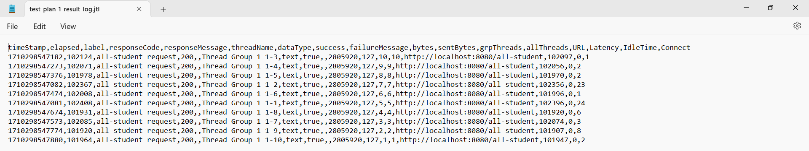

##TUTORIAL 5##
**NAMA :SHERYL IVANA WIDJAJA**
**NPM  :2206824943**
**ADPRO A**

JMeter GUI results (Before refactor profiling):  
  
  
    
  
CLI JMeter Results (Before refactor profiling):  
  
  
  
  
CLI JMeter Results (After refactor profiling):  
  
  
  
  
It can be seen that the time difference before and after the refactor is much different. The execution speed after optimization is much faster. For example, in getAllStudentCourses (/all-student) which was originally 100000s to 20000 ms (500% faster), in /all-student-name which was originally 2000s to 140s (14 times or 1400% faster), and in /highest-gpa which was originally 100s to only a dozen (11 times or 1100% faster). So, optimization of a program will have a big effect on blackbox application testing using JMeter.  

**REFLECITON 5**

1. Pengujian kinerja dan profilisasi adalah dua pendekatan berbeda yang digunakan dalam konteks mengoptimalkan kinerja aplikasi. Berikut adalah perbedaannya:

   Pengujian Kinerja (misalnya, dengan JMeter): Pengujian kinerja dilakukan pada tingkat sistem, di bawah berbagai jenis beban. Ini memastikan sistem Anda memenuhi Perjanjian Tingkat Layanan (SLA)nya. Jenis pengujian ini biasanya digunakan untuk memahami bagaimana aplikasi berperilaku dalam kondisi-kondisi tertentu, seperti beban berat atau dengan banyak pengguna bersamaan.

   Profilisasi (misalnya, dengan IntelliJ Profiler): Profilisasi, di sisi lain, dilakukan ketika pengujian kinerja menunjukkan masalah. Ini membantu Anda mengidentifikasi bagian-bagian sistem Anda yang paling berkontribusi pada masalah kinerja dan menunjukkan di mana Anda harus fokuskan upaya Anda. IntelliJ IDEA menyediakan integrasi dengan profilis seperti Java Flight Recorder dan Async Profiler. Profilis ini mengumpulkan informasi berharga tentang perilaku kode Java Anda saat runtime, menentukan di mana titik-titik panasnya, dan membantu memahami bagaimana sebuah kerangka kerja beroperasi di bawah keadaan tertentu. Profiler IntelliJ menggunakan pengambilan sampel, sehingga overheadnya sangat rendah - hampir sama dengan menjalankan program tanpa profiler.

   Secara ringkas, sementara pengujian kinerja memberikan pandangan pada tingkat sistem tentang kinerja aplikasi Anda, profilisasi memungkinkan Anda menelusuri hingga ke tingkat kode untuk mengidentifikasi dan menangani bottleneck kinerja tertentu. Keduanya adalah alat penting dalam proses mengoptimalkan kinerja aplikasi. Mereka saling melengkapi dan sering digunakan bersama selama proses optimasi kinerja.

2. Profilisasi membantu saya mengetahui bagian mana dari program yang menghambat kinerja keseluruhan aplikasi. Dengan demikian, saya hanya perlu mengoptimalkan bagian-bagian tersebut sehingga aplikasi keseluruhan akan meningkatkan kinerjanya tanpa perlu memperbaiki terlalu banyak bagian dari aplikasi.

3. Ya, seperti contoh latihan dalam tutorial, dengan profiler Intellij, saya dapat mengetahui bahwa bagian dari program yang memakan waktu paling lama adalah metode findStudentWithHighestGpa. Saya bahkan dapat mengetahui baris mana dalam metode tersebut yang menghambat kinerja metode tersebut. Karena saya mendapatkan informasi tentang durasi waktu yang dibutuhkan untuk menjalankan panggilan fungsi, saya dapat lebih mudah mendeteksi bagian mana dari program yang menjadi bottleneck bagi program yang lebih besar.

4. Salah satu hal yang paling menantang tentang melakukan pengujian kinerja dan profilisasi adalah memahami hasil output yang relevan dan mengidentifikasi bagian-bagian mana dari program yang menjadi bottleneck dalam aplikasi. Cara mengatasi ini adalah dengan memeriksa output JMeter atau profilis dengan teliti dan perlahan, dan mungkin memerlukan waktu untuk terbiasa dengan teknologi baru ini agar mendapatkan informasi penting lebih mudah.

5. Seperti yang disebutkan sebelumnya, menggunakan profiler IntelliJ memungkinkan saya untuk mengidentifikasi bagian-bagian bottleneck dari program, mengetahui berapa lama waktu yang dibutuhkan untuk menjalankan panggilan metode, dan seberapa sering metode tersebut dipanggil. Dengan informasi ini, kita dapat menyesuaikan bagian-bagian program yang perlu dioptimalkan dan mengabaikan yang tidak perlu. Penting untuk diingat bahwa "optimisasi yang terlalu dini adalah akar dari segala kejahatan", karena upaya optimisasi yang tidak perlu hanya akan mengurangi keterbacaan kode kita.

6. Sampai saat ini, saya belum mengalami kasus yang dibahas, tetapi dari literatur yang saya baca, kinerja JMeter dipengaruhi oleh berbagai faktor seperti sistem operasi, versi JVM, dan lain-lain. Variasi ini dapat menghasilkan perbedaan dalam pengujian JMeter antara satu perangkat dan yang lain. Cara mengatasi hal ini, seperti yang disarankan dalam tautan yang saya temukan di https://stackoverflow.com/questions/68666822/jmeter-results-not-consistent-and-depend-from-the-running-machine, adalah dengan menggunakan kontainer seperti Docker daripada file .jmx, dan juga memperhatikan waktu berpikir. Dengan melakukan hal ini, diharapkan hasil pengujian JMeter akan lebih konsisten dan tidak fluktuatif dari satu mesin ke mesin lain.

    Selain itu, penting untuk diingat bahwa hasil pengujian dari profiler dan JMeter dapat berbeda karena cara kerja yang berbeda, di mana JMeter fokus pada pengujian persistensi aplikasi.

7. Tindakan yang saya ambil untuk meningkatkan kinerja kode setelah proses pengujian dan profilisasi selesai adalah dengan memeriksa durasi yang dibutuhkan oleh program untuk merespons permintaan menggunakan JMeter. Jika respon terlalu lambat, saya kemudian menggunakan profiler untuk menemukan bagian kode yang menjadi bottleneck dan menemukan cara untuk meningkatkan kinerjanya. Setelah melakukan perubahan, saya memastikan bahwa outputnya tetap sama seperti sebelumnya untuk menjamin kebenaran kode tersebut. Untuk langkah yang lebih aman, saya juga membangun pengujian unit seperti yang dibahas dalam tutorial sebelumnya, dan menjalankannya. Jika pengujian unit berhasil, kode yang dimodifikasi seharusnya berfungsi dengan baik. Namun, penting untuk menilai apakah pengujian unit yang dibuat sebenarnya efektif dan relevan.
